## Hands On Labs

- Oracle Code Sydney July 2017

### Create the OCCS Instance 
This section provides instructions to create an OCCS Service Instance, create a Stack definition and deploy the MedRec app and MongoDB into Docker containers on OCCS.

It is assumed that you already have registered for an Oracle Public Clou=d subscription.

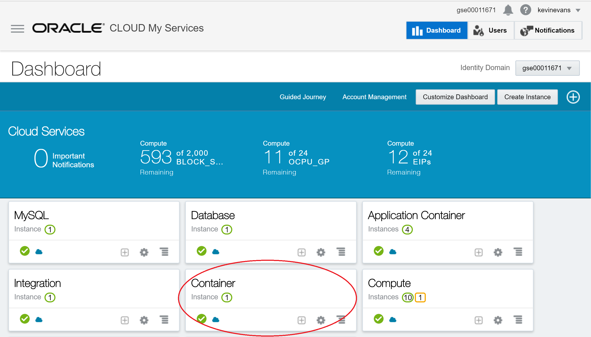

Click

Click 

Click

Click

Click

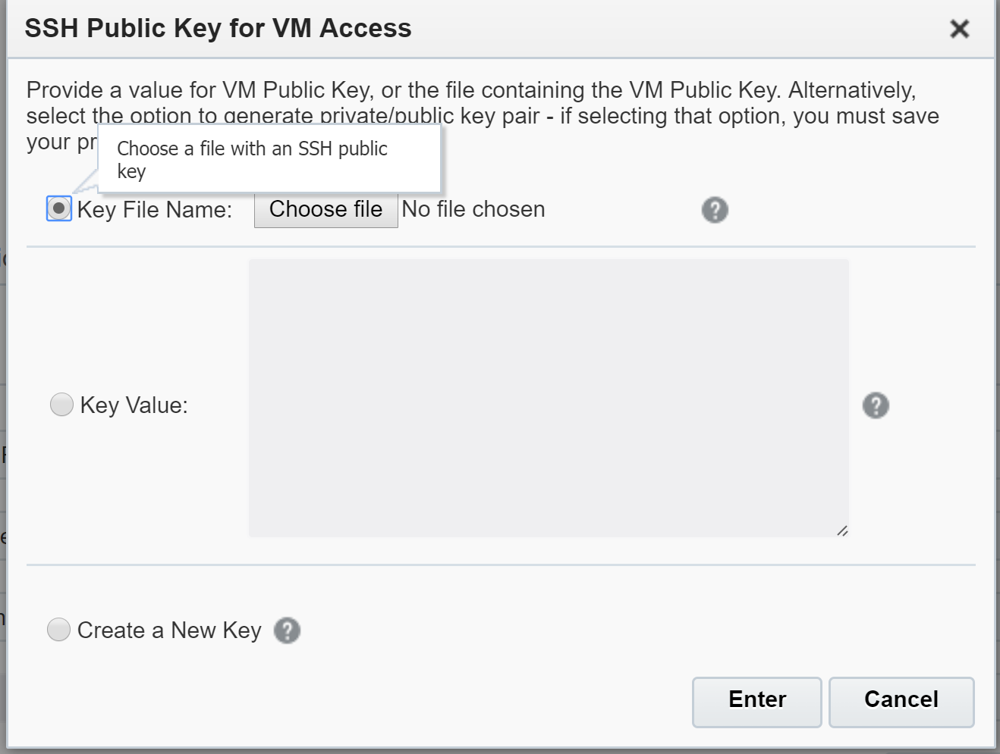

Click 

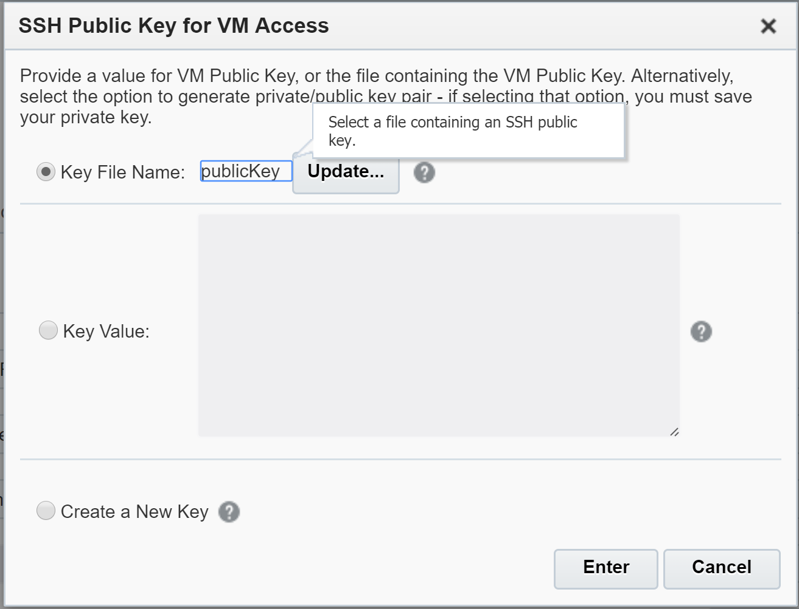

Click 

Click 

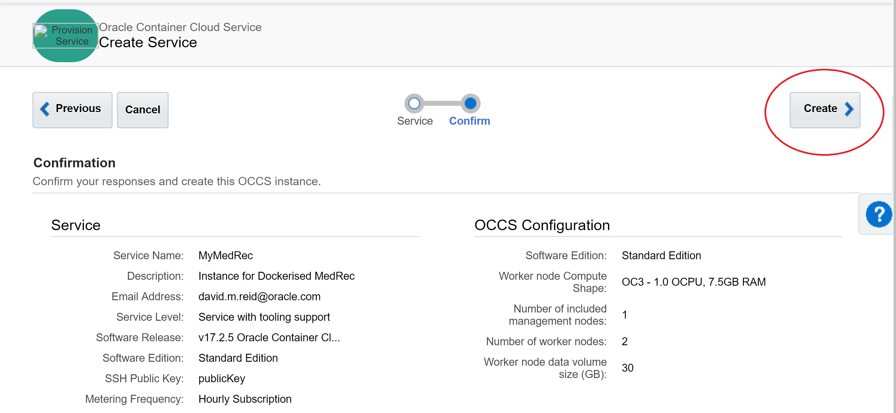

Click 

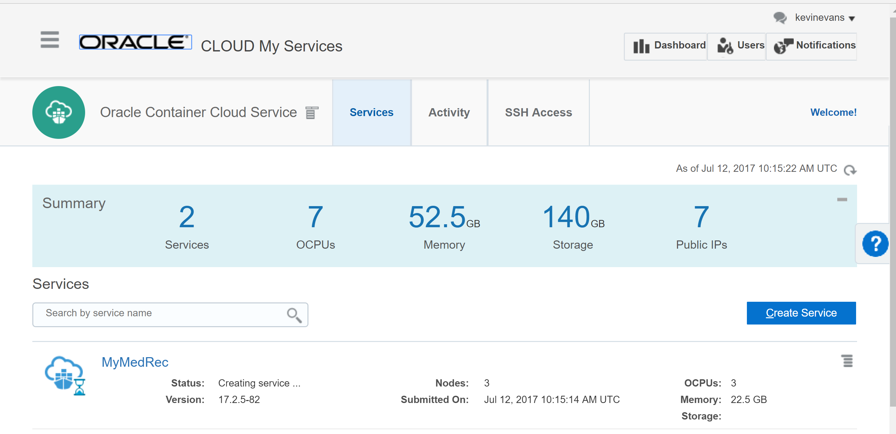

Click 

Click 

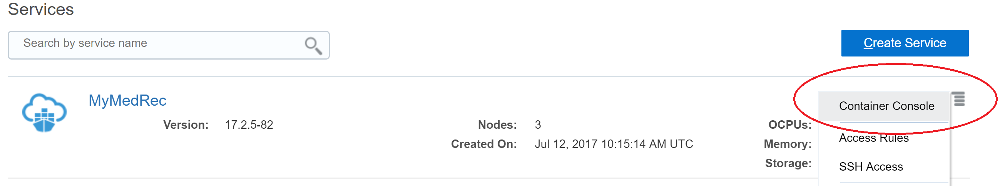

Click 

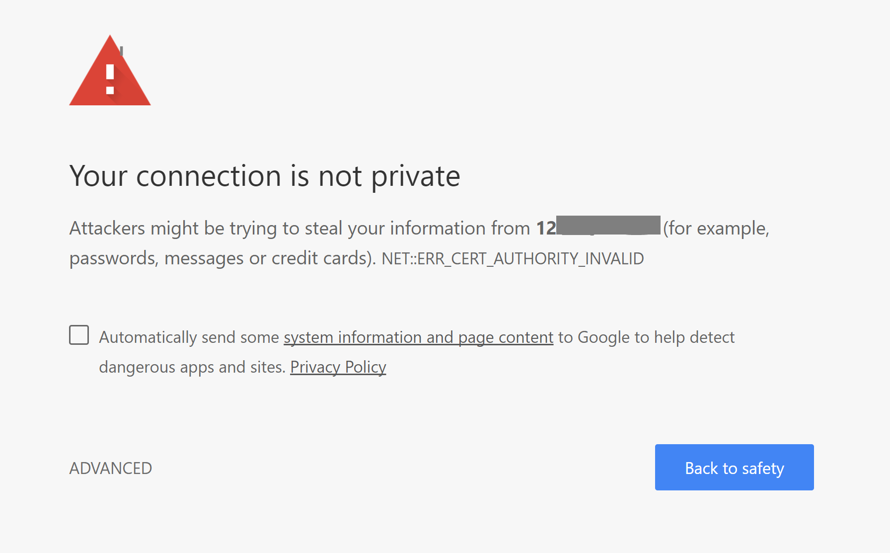

Click 

Click 

Click 

Click 

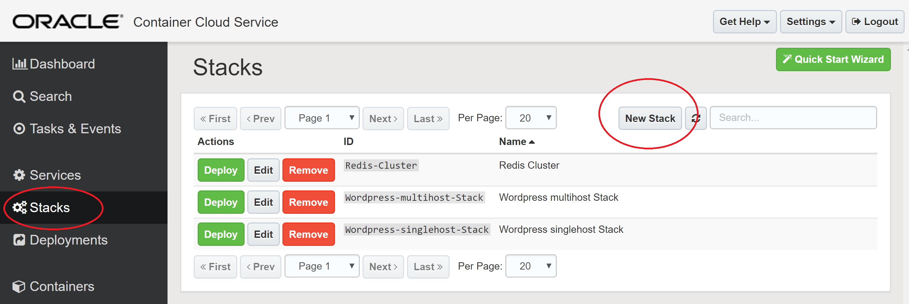

Click 

Click 

Click 

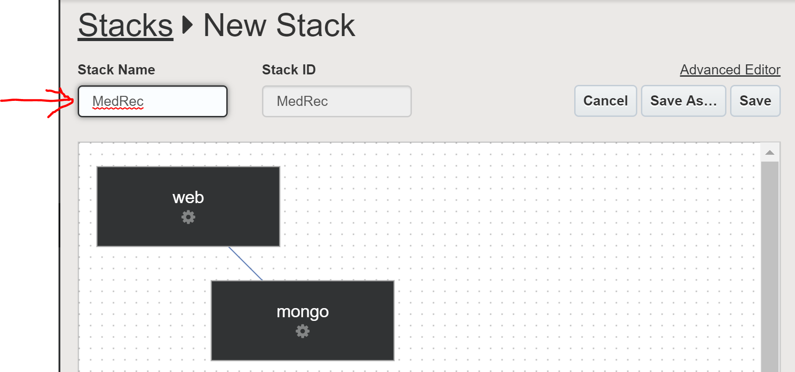

Click 

Click 

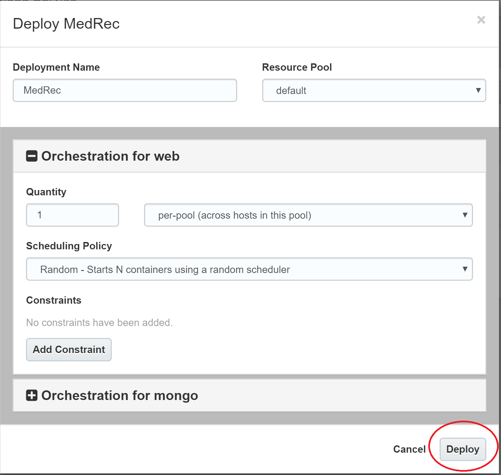

Click 

Click 

Click 

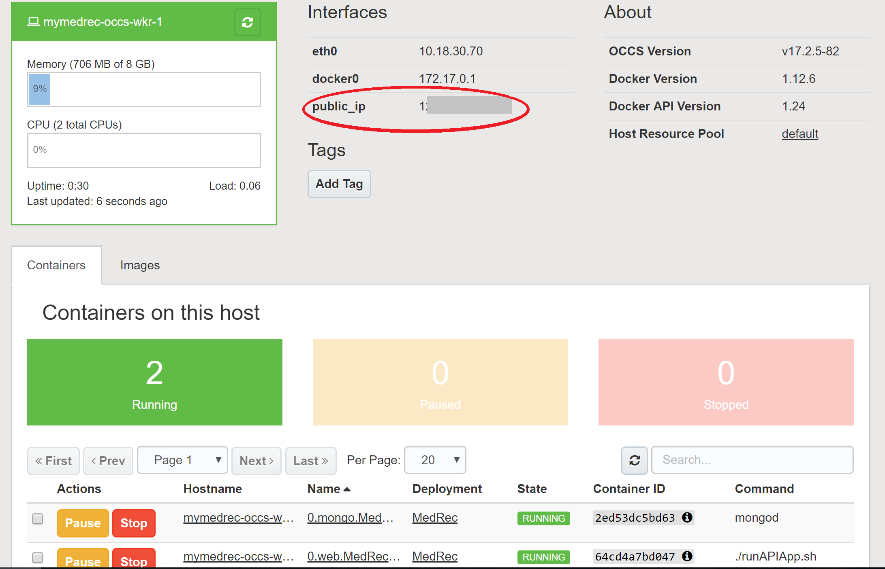

Click 

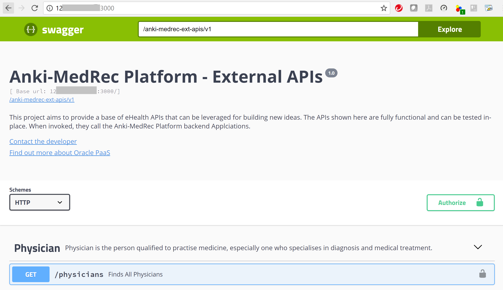

* No warranty expressed or implied.  Software is as is.
* [MIT License](http://www.opensource.org/licenses/mit-license.html)

<a href="../../handsonlabs" class="btn" >Back to Hands On Lab Menu</a>

