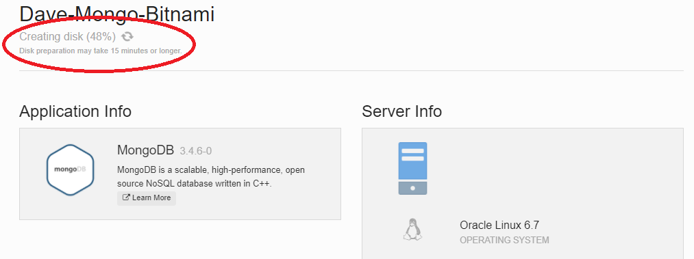
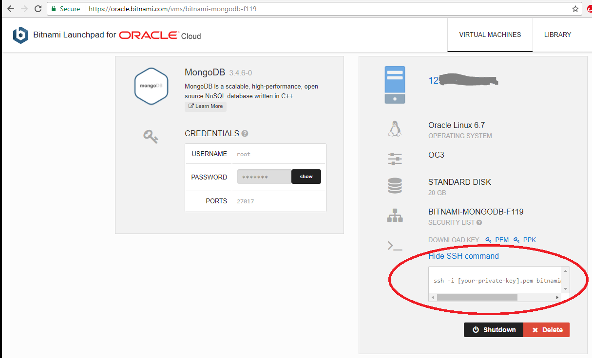

## Hands On Labs

- Oracle Code Sydney July 2017

### Provision MongoDB on Oracle IaaS

This section provides instructions to provision a Virtual Machine that has MongoDB pre-installed and run the VM on the Oracle Infrastructure As A Service (IaaS).

Bitnami provides pre-packaged application images for Oracle Cloud Platform servers, so that you can get productive with your new server immediately. You can access and launch these images in two ways: through the free Bitnami Launchpad for Oracle Cloud Platform, which gives you an intuitive Web-based dashboard to create and manage your Oracle Cloud Platform servers, or through the Oracle Cloud Marketplace, Oracle's digital platform for software applications.

You will use the Bitnami Launchpad for Oracle Cloud. Before you start the lab you will need to[sign-up for a Bitnami account by following Steps 1 and 2](https://docs.bitnami.com/oracle/get-started-launchpad/#step-1-register-with-bitnami)

With the Bitnami SignUp process now out the way, login to your Bitnami account (if you're not already logged in).
Point your browser to the [Bitnami Launchpad for Oracle Cloud Platform](https://oracle.bitnami.com/).


Select the "Sign in with Bitnami" link in the top right corner.


You should now be successfully authenticated from Bitnami.


### Provision the VM

Click the Library Tab in the top right and enter MongoDB into the Application Search area.
Press Search


Select MongoDB


Your screen showuld look something like the following.
Note: it will show your Identity Domain rather than gseXXX.
Enter a menaningful name and accept the defaults.
Note that a public IP address will be assigned and ports 22 (ssh) and 27017 will be opened.


The OC3 computer shape (1 OCPU with 7.5 GB RAM) will be enough.


Press the Create button


The process to create the VM takes a few minutes.


Status updates flow into the console as the provisioning of the VM on to Oracle IaaS progresses.



Eventually the provisioning completes and you wil see the allocated IP address for the VM.


### Putty / SSH to your MongoDB VM 

We now need to create a User within MongoDB so that we add some additional security to our MongoDB environment.
In order to create the user we need to ssh connect to the running VM.

You may have noticed that 
- Private Keys are available for you to download so you can ssh / Putty connect to the VM.
- the root password is provided


You can click to show the SSH command required.



Download the ppk / pem files onto your local filesystem.
Establish an ssh connection to the VM using the details provided.
I used Putty and have included the steps below.

For the hostname specify 
``` 
bitnami@YourIpAddress
```
Choose SSH from the Radio Buttons.
Set the Port to 22


Under the Categories in the left pane, Choose Auth which is located under Connections -> SSH -> Auth.
Browse to locate the ppk file you downloaded earlier.


Scroll up to the Session Category.
Name your Session under the Saved Sessions.
Press Save


Press the Open button to establish the connection.
You will need to accept the host, and the session established should look something the following screenshot.


### Create a user in MongoDB

Having established an SSH connection, we can now create the MongoDB user within our database.


* No warranty expressed or implied.  Software is as is.
* [MIT License](http://www.opensource.org/licenses/mit-license.html)

<hr />
<center>
<a href="../../handsonlabs" class="btn" >Back to Hands On Lab Menu</a>
<center />
<hr />


