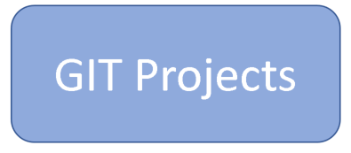
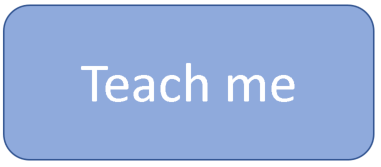
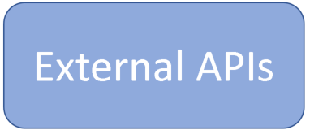
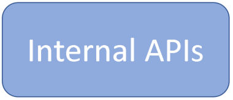

**MedRec Platform Vision**
===================

The MedRec Platform is essentially a playpen with some basic elements at its core such as,
 
-	a rudimentary System of Record (Avitek – MedRec) to act as a discussion point around Systems of Record, and the need to differentiate and innovate outside of the Systems of Record.
- a re-developed next generation version of MedRec based on a MicroServices based approach (MedRec NG) to deliver learnings around API development and DevOps.
- a modern User Interface rolled on top of the API's developed for MedRec NG to demonstrate what is possible re improved customer experience.
-	Java based internal APIs that support CRUD operations against MedRec NG to provide a starting point upon which participants can bring their innovative ideas to explore and prove.

With the core application and internal API’s locked down as Version 1, the Castle will then serve as a vehicle to overlay innovative ideas and implement them using various Oracle (IaaS, PaaS, SaaS) services and Open Source software to demonstrate proof points around the ideas. It is anticipated that this opportunity to innovate will generate activity from Oracle Pre-Sales, Partners and Developers and support Hackathon activities during FY18.

## Target Audience / Usage

The Castle will support a diverse range of users and activities, such as,

-	Sales and Pre-Sales (functional demonstrations of Oracle Cloud Services)
-	Pre-Sales (technical demonstrations and POC's of Oracle Cloud Services)
-	Pre-Sales Speed To Value Workshops: 
--	CloudInAction
--	APIsInAction
--	DevelopersInAction
--	Others
-	Oracle Business Partners 
-	Developers in Hackathons (refer Hackathons.md)
-	University Students (refer Unis.md)

----------

|   |   | 
|   |   |

