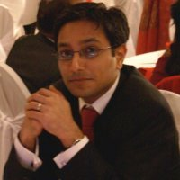
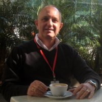
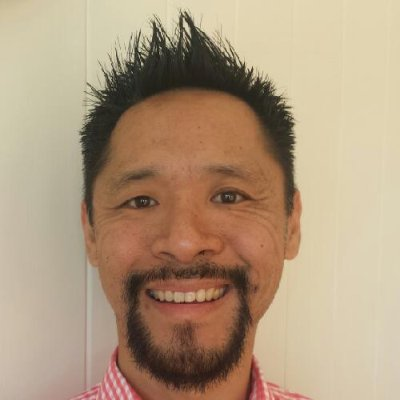

**MedRec Platform Vision**
===================

**Dream Team**

----------

| Profile | Name | Role |
| ------------- | ------------- |------------- |
|   | <a href="https://www.linkedin.com/in/franco-ucci-9007076b/">Franco Ucci</a> | Visionary Lead |
|   | <a href="https://www.linkedin.com/in/alimukadam/">Ali Mukadam</a> | Team Leader |
|   | <a href="https://www.linkedin.com/in/davidmreid/">David Reid</a> | Solution Architect |
|   | <a href="https://www.linkedin.com/in/citurria/">Carlos Rodriguez Iturria</a> | Integration Architect |
|   | <a href="https://www.linkedin.com/in/jasonloweinbne/">Jason Lowe</a> | DevOps Architect |
|   | <a href="https://www.linkedin.com/in/ozayrsyed/">Ozayr Syed</a> | IOT Architect |
|   | <a href="https://www.linkedin.com/in/john-graves-963b83/">John Graves</a> | IOT Architect |
|   | <a href="https://www.linkedin.com/in/vijaykumaryenne/">Vijay Kumar Yenne</a> | DX Lead |

----------

